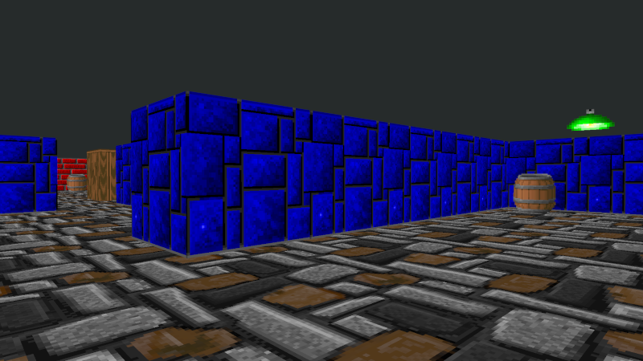

# wolf3d
It's 3D game inspired by DOS wolf3d\
Screenshot:

# Dependencies
It requires SFML 2.5.1, openGL, GLEW, cmake and g++

# Control
**Mouse moves camera**
| Key	| Behavior		|
| :---: | :------------ |
| W 	| go forward	|
| S 	| go backward	|
| A 	| go left		|
| D 	| go right		|
| Up 	| go forward	|
| Down 	| go backward	|
| Left 	| look left		|
| Right | look right	|
| G		| Noclip		|
| Tilde | Debug info	|
| Escape|exit			|

# Thanks
Graphics are from Lode Vandevenne and Lotos

# Bugs
You can go few pixels in wall - I'll fix this in future